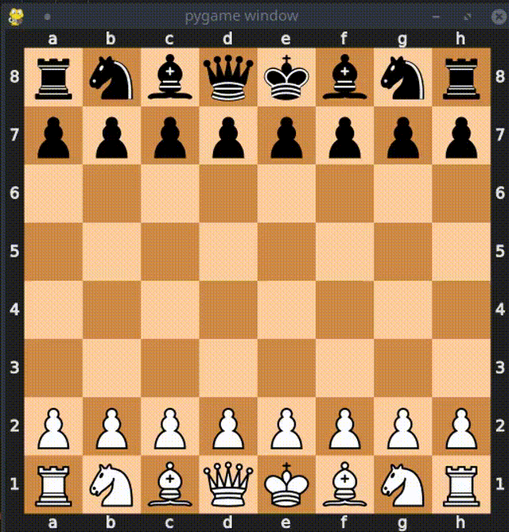
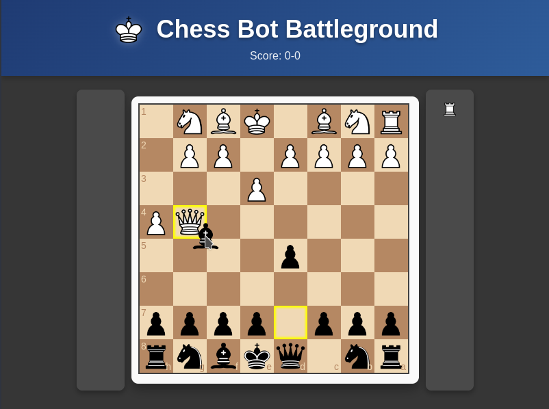

<!-- Banner Start -->
<div align="center">
  

# ChessBot Battleground

**Chess AI Training & Battleground Platform**

[**Getting Started**](#getting-started) • [**Tutorial**](./tutorials/tutorial_usage_and_tips.md) • [**Dataset**](#-dataset) • [**Training**](#-training) • [**Inference & Battling**](#-inference--battling) • [**Models**](#models)

*[Dataset now on HuggingFace](https://huggingface.co/datasets/KeithG33/ChessBot-Dataset/tree/main)* 

*[Models on HuggingFace:](https://huggingface.co/collections/KeithG33/chessbot-battleground-68604718dc092ec82e3a2c42)*

`swin_chessbot`, `sgu_chessbot` 

</div>
<!-- Banner End -->

##  Introduction

This repository contains a gigantic curated chess dataset meant for machine learning, along with the supporting code to train, infer, display, and play games. Design a model and you can take advantage of any of the available features. This library provides support for:

- **Dataset/Training:** PyTorch dataset and training code
- **Evaluation**: Compare performance on the test set. *Leaderboard coming soon*
- **Game App:**  Play against your model with the `chessbot play` tool. Can it beat you?
- **Visualization:** Watch your models in action as they play and adapt on the board.
- **MCTS:** Simple implementation to give your supervised models search capability. *Training coming soon*.

With enough parameters and training, models will play better than some humans. Here's the `sgu_chessbot` in action:

<div align="center"  id="chess-battle-gif">
  
  <p><em>Self-play after a few days of training a 300M parameter network from scratch on a single RTX 3090.</em></p>
</div>


## 📂 Dataset
Dataset is *[available on HuggingFace.](https://ishortn.ink/chessbot-dataset)*  

Currently the dataset contains approximately **700 million positions** in **PGN format**, split across 1000 files. Huge credits to the following main sources:

- Lumbra's Database (filtered 2600+)
- Lichess Puzzle Database
- Computer Chess: TCEC Database, CCRL
<!-- - (*coming soon*) Stockfish Data: position evaluation, puzzle solutions, best-move sequences   -->
  
      
The PyTorch `HFChessDataset` is a wrapper around the HuggingFace dataset to easily get you started:

```python
from chessbot.data import HFChessDataset

dataset     = HFChessDataset(split='test') # or 'train'
dataloader  = DataLoader(dataset, batch_size=128, num_workers=4)
batch       = next(iter(dataloader))

states  = batch[0]  # (B, 8, 8),
actions = batch[1]  # (B, 4672)
results = batch[2]  # (B,)
```

This will stream the data to avoid large disk and RAM usage. To load pgn files directly, use the `ChessDataset` class. This is useful for smaller datasets or loading your own data:

```python
import chessbot.data.ChessDataset

pgn_files   = 'path/to/pgn_files' # File, directory, or list of files
num_proc    = 8                   # Num files to load in parallel

dataset     = ChessDataset(pgn_files, num_processes=num_proc)
dataloader  = DataLoader(dataset, batch_size=bsz)
batch       = next(iter(dataloader))
```
## 🤖 Models

Design your model and see how it does! To take advantage of the training and inference code, models should subclass the `BaseChessBot` class and follow the expected format:
1. **Input**: `(B, 1, 8, 8)` tensor for position
2. **Output**: a policy distribution of shape `(B, 4672)`, and expected value of shape `(B, 1)`.

A minimal example of writing a model:
```python
from chessbot.models import BaseChessBot, ModelRegistry

@ModelRegistry.register('simple_chessbot')
class SimpleChessBot(BaseChessBot):
  """ One layer backbone and one layer prediction heads """
    
    def __init__(self):
      super().__init__()
        
      # Mini backbone
      self.backbone = nn.Linear(64, 256)

      # Policy head
      self.policy_head = nn.Linear(256, self.action_dim)
        
      # Value head
      self.value_head = nn.Sequential(
          nn.Linear(256, 1),
          nn.Tanh()  # Between -1 and 1 for lose, draw, win
      )

    def forward(self, x):
      """ Input is tensor of shape (B,1,8,8) """
      x             = x.view(B, -1)               # -> (B, 64)
      features      = self.backbone(x)            # -> (B, 256)
      action_logits = self.policy_head(features)  # -> (B, 4672)
      board_val     = self.value_head(features)   # -> (B, 1)

      return action_logits, board_val
```

The `ModelRegistry` is a helper for the library to store models by name, and everything in the [models/](models/)
directory is automatically pre-registered. 
## 🧠 Training


The `ChessTrainer` class is the easiest way to get started training ChessBot models. It relies on a huggingface dataset to efficiently stream the data, and accelerate for easy access to many features like mixed-precision, gradient clipping, etc.

Here's an example you can run of setting up a config and using it. Adjust for your hardware if needed:

```python
import os
import chessbot
from chessbot.train import HFChessTrainer
from chessbot.models import MODEL_REGISTRY

# Train
cfg = chessbot.config.get_cfg()
cfg.train.epochs = 50 
cfg.train.batch_size = 1024
cfg.train.lr = 0.0001
cfg.train.scheduler = 'linear'
cfg.train.min_lr = 0.00005
cfg.train.warmup_lr = 0.00001
cfg.train.warmup_iters = 1000
cfg.train.compile = True
cfg.train.amp = 'bf16'
cfg.train.validation_every = 15_000
cfg.dataset.num_workers = 4
cfg.dataset.num_test_samples = 1_000_000
cfg.dataset.shuffle_buffer = 100_000

if __name__ == '__main__':
    # Use registry, but loading your model directly is fine
    # eg: model = YourChessBot()
    model = MODEL_REGISTRY.load_model('swin_chessbot')
    trainer = HFChessTrainer(cfg, model)
    trainer.train()
```

Check out [`chessbot/train/config.yaml`](chessbot/train/config.yaml) for a list and description of the available options. The [Getting Started](#-getting-started) section also shows the command-line method of running training.


## 🕹️ Gameplay & Inference

Take your models to the battleground! The library depends on an **Adversarial Gym Environment** to visualize model inference. Use the game app to play a game against your model, or use the inference functions in [`chessbot.inference`](chessbot/inference/) to run CPU games.

### Game App

Play any registered model directly from the CLI:

```bash
# play the pretrained model, can you beat it?
chessbot play "swin_chessbot" --model-weights KeithG33/swin_chessbot

# play with local weights
chessbot play "swin_chessbot" --model-weights path/to/weights.pt

```

### CPU Inference

```python
from chessbot.inference import selfplay, run_match

# Self-play a single model
model1 = YourChessBot()
outcome = selfplay(model1, visualize=True)  # [-1, 0, 1] outcome

# Duel two models with optional MCTS
model2 = YourChessBot()
scores = run_match(model1, model2, best_of=11, search=True, visualize=True)
```

Set `search=True` to harness **Monte Carlo Tree Search (MCTS)**. The [Chess Battle GIF](#chess-battle-gif) shows a game using the Chess-env and MCTS at test time.


## ✨ Getting Started
The python code was covered above, so for the sake of learning, this Getting-Started will mostly focus on showing the `chessbot` command-line tool version of things. 

### 1. Installation: 

**Install ChessBot-Battleground:**

  ```bash
  # Either install from source...
  git clone https://github.com/KeithG33/ChessBot-Battleground.git
  cd ChessBot-Battleground
  pip install -r requirements.txt
  pip install -e .

  # Or install via pip 
  pip install git+https://github.com/KeithG33/ChessBot-Battleground.git
  ```

**Verify Installation:**

```bash
$ chessbot --help
                                                                                                       
 Usage: chessbot [OPTIONS] COMMAND [ARGS]...                                                                                                                                                                                          
                                                                                                                                                                                                                                      
 ChessBot CLI Tool                                                                                                                                                                                                                    
                                                                                                                                                                                                                                      
╭─ Options ──────────────────────────────────────────────────────────────────────────────────────────────────────────────────────────────────────────────────────────────────────────────────────────────────────────────────────────╮
│ --install-completion          Install completion for the current shell.                                                                                                                                                            │
│ --show-completion             Show completion for the current shell, to copy it or customize the installation.                                                                                                                     │
│ --help                        Show this message and exit.                                                                                                                                                                          │
╰────────────────────────────────────────────────────────────────────────────────────────────────────────────────────────────────────────────────────────────────────────────────────────────────────────────────────────────────────╯
╭─ Commands ─────────────────────────────────────────────────────────────────────────────────────────────────────────────────────────────────────────────────────────────────────────────────────────────────────────────────────────╮
│ evaluate   Evaluate a model. Pass additional positional arguments with --model-arg and keyword arguments as a JSON string via --model-kwargs.                                                                                      │
│ download   Download a dataset from a GitHub release.                                                                                                                                                                               │
│ play       Play a game against the bot using a loaded model. Pass additional positional arguments with --model-arg and keyword arguments as a JSON string via --model-kwargs.                                                      │
│ train      Train a model using the provided configuration file and optional overrides.                                                                                                                                             │
╰────────────────────────────────────────────────────────────────────────────────────────────────────────────────────────────────────────────────────────────────────────────────────────────────────────────────────────────────────╯
```


### 2. Check the Dataset:
*[See the dataset on HuggingFace](https://huggingface.co/datasets/KeithG33/ChessBot-Dataset/tree/main)* 

If you want to see the dataset, either use the HuggingFace UI in the link or use the `chessbot` cli tool:
```bash
# For options and help
chessbot download --help 

# Download latest release to cwd if pip installed, or ChessBot-Battleground/dataset if source installed.
chessbot download
```

By default, the latest release will be downloaded into the `ChessBot-Battleground/dataset/` directory, or the current working directory if the package has been pip installed.

### 3. Models & Training
After installation, it's time to write a model and injest some data. Here's another full example you can run:

```python
import os
import chessbot
from chessbot.train import HFChessTrainer
from chessbot.models import BaseChessBot

class SimpleChessBot(BaseChessBot):
  """ One layer backbone and one layer prediction heads """
    
    def __init__(self):
      super().__init__()
      # Backbone and prediction heads
      self.backbone = nn.Linear(64, 256)
      self.policy_head = nn.Linear(256, self.action_dim)
      self.value_head = nn.Sequential(
          nn.Linear(256, 1),
          nn.Tanh()  # Between -1 and 1 for lose, draw, win
      )

    def forward(self, x):
      """ Input is tensor of shape (B,1,8,8) """
      x             = x.view(B, -1)               # -> (B, 64)
      features      = self.backbone(x)            # -> (B, 256)
      action_logits = self.policy_head(features)  # -> (B, 4672)
      board_val     = self.value_head(features)   # -> (B, 1)
      return action_logits, board_val


if __name__ == '__main__':
    cfg = chessbot.config.get_cfg()
    cfg.train.epochs = 50 
    cfg.train.batch_size = 1024
    cfg.train.lr = 0.0001
    cfg.train.scheduler = 'linear'
    cfg.train.min_lr = 0.00005
    cfg.train.warmup_lr = 0.00001
    cfg.train.warmup_iters = 1000
    cfg.train.compile = True
    cfg.train.amp = 'bf16'
    cfg.train.validation_every = 15_000
    cfg.dataset.num_workers = 4
    cfg.dataset.num_test_samples = 1_000_000
    cfg.dataset.shuffle_buffer = 100_000

    model = SimpleChessBot()

    trainer = HFChessTrainer(cfg, model)
    trainer.train()
```

For the CLI version of training, you can use the `chessbot` cli tool. First register your model, and then configure `model.path` (path to your model file) and `model.name` (class name) to load the model. Either set this in the config file, or use the command overrides:

```bash
# For options and help
chessbot train --help

# Train from config, and any overrides in command
chessbot train /path/to/config.yaml \
              -o model.path path/to/simple_chessbot.py \
              -o model.name SimpleChessBot \
              -o train.epochs 10 \
              -o train.lr 0.001 \
```

Additionally, `model.args` and `model.kwargs` exist for the model init. Use a list and dictionary, respectively.

> **✨ Tip:** If your model is in the `models/` directory then just `model.name` is required. It will be auto-registered.


### 4. Leaderboard / Evaluation
Share your model's results on the test set. Compare your scores against the leaderboard. Once you've trained a model run the provided evaluate script to get your test set metrics.

```python
from chessbot.inference.evaluate import evaluate_model

# Load and evaluate model
model = ChessModel()
batch_size = 3072
num_processes = 8
evaluate_model(model, batch_size, num_processes)
```

Or if your model is registered as "your_chessbot", using the `chessbot` cli tool:
```bash
# For options and help:
chessbot evaluate --help

  chessbot evaluate "your_chessbot" \
                  --model-dir path/to/dir \
                  --model-weights path/to/weights.pt \
                  --batch-sz 3072 \
                  --num-threads 8 \
```

### 5. Play Your ChessBot
A historically important question for humankind: *Can your model beat you?*


```bash
# For options and help
chessbot play --help

chessbot play "your_chessbot" \
              --model-dir /path/to/dir \
              --model-weights /path/to/weights.pt

# Or load weights directly from HuggingFace
chessbot play "swin_chessbot" \
              --model-weights KeithG33/swin_chessbot
```

```bash
# Selfplay or battle two models
chessbot selfplay "swin_chessbot" --model-weights KeithG33/swin_chessbot

chessbot play-match "swin_chessbot" "simple_chessbot" \
               --player1-weights KeithG33/swin_chessbot \
               --player2-weights /path/to/simple_weights.pt
```

<div align="center">
  
  <p><em> Punishing a beautiful queen sac from a randomly initialized model ;)</em></p>
</div>

### 6. Examples

There is a simple and complete example in [models/](models/) to get you started. Check out the `example_chessbot` project for an example; use `example_training.ipynb` to train the model; use `example_inference.ipynb` to either run inference with the base model, or with an MCTS wrapper for a test-time-powerup.

Otherwise check out the other models in the `models/` directory.

Additionally, an `example_sf_datagen.ipynb` exists to show how one might add Stockfish data to the dataset. Unfortunately stockfish is slow so this is a hopeful crumb that I leave for crowd efforts.


## 📈 Future Plans

- Get to an epic milestone of **1 billion positions**
- Clean, de-duplicate, and expand the dataset with Stockfish data
- Release **MCTS training pipelines**.
- Train more models, add a leaderboard


## 🛠️ Contributing

If you have ideas, improvements, or bug fixes, feel free to open an issue or submit a pull request. And same with questions or further discussion, don't hesitate to reach out!
