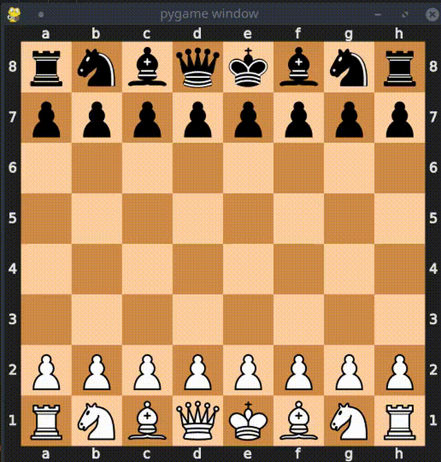

<!-- Banner Start -->
<div align="center">
  

# ChessBot Battleground

**Chess AI Training & Battleground Platform**

[**Getting Started**](#getting-started) • [**Examples**](./examples/tutorial_usage_and_tips.md) • [**Dataset**](#-dataset) • [**Training**](#-training) • [**Inference & Battling**](#-inference--battling) • [**Models**](#models)

*[Dataset now on HuggingFace](https://huggingface.co/datasets/KeithG33/ChessBot-Dataset/tree/main)* 

*[Models on HuggingFace](https://huggingface.co/collections/KeithG33/chessbot-battleground-68604718dc092ec82e3a2c42)*


</div>
<!-- Banner End -->

##  Introduction

This repository contains a gigantic curated chess dataset meant for machine learning, along with the supporting code to train, infer, display, and play games. Design a model and you can take advantage of any of the available features. This library provides support for:

- **Dataset/Training:** PyTorch dataset and training code
- **Evaluation**: Compare performance on the test set. *Leaderboard coming soon*
- **Game App:**  Play against your model with the `chessbot play` tool. Can it beat you?
- **Visualization:** Watch your models in action as they play and adapt on the board.
- **MCTS:** Simple implementation to give your supervised models search capability. *Training coming soon*.

With enough parameters and training, models will play better than some humans. Here's the `sgu_chessbot` in action:

<div align="center"  id="chess-battle-gif">
  
  <p><em>Self-play after a few days of training a 300M parameter network from scratch on a single RTX 3090.</em></p>
</div>

Play against the models on huggingface using the `chessbot play` command:

```bash
# Can you beat them?
chessbot play "sgu_chessbot" --model-weights KeithG33/sgu_chessbot

chessbot play "swin_chessbot" --model-weights KeithG33/swin_chessbot
```


## 📂 Dataset
Dataset is *[available on HuggingFace.](https://ishortn.ink/chessbot-dataset)*  

Currently the dataset contains approximately **4 billion positions** in compressed **PGN format**. Huge credits to the following main sources:

- Deepmind's ChessBench
- LC0 training data  
- Lichess Puzzle Database
- TCEC and CCRL Databases

  
      
The PyTorch `HFChessDataset` is a wrapper around the HuggingFace dataset to easily get you started:

```python
from chessbot.data import HFChessDataset

dataset     = HFChessDataset(split='test') # or 'train'
dataloader  = DataLoader(dataset, batch_size=128, num_workers=4)
batch       = next(iter(dataloader))

states  = batch[0]  # (B, 8, 8),
actions = batch[1]  # (B, 4672)
results = batch[2]  # (B,)
```

This will stream the data to avoid large disk and RAM usage. To load pgn files directly, use the `ChessDataset` class. This is useful for smaller datasets or loading your own data:

```python
import chessbot.data import ChessDataset

pgn_files   = 'path/to/pgn_files' # File, directory, or list of files
num_proc    = 8                   # Num files to load in parallel

dataset     = ChessDataset(pgn_files, num_processes=num_proc)
dataloader  = DataLoader(dataset, batch_size=bsz)
batch       = next(iter(dataloader))
```
## 🤖 Models

Design a model and see how it does! To take advantage of the training and inference code, models should subclass the `BaseChessBot` class and follow the expected format:
1. **Input**: `(B, 1, 8, 8)` tensor for position
2. **Output**: a policy distribution of shape `(B, 4672)`, and expected value of shape `(B, 1)`.

A minimal example of writing a model:
```python
from chessbot.models import BaseChessBot, ModelRegistry

@ModelRegistry.register('simple_chessbot')
class SimpleChessBot(BaseChessBot):
  """ One layer backbone and one layer prediction heads """
    
    def __init__(self):
      super().__init__()
        
      # Mini backbone
      self.backbone = nn.Linear(64, 256)

      # Policy head
      self.policy_head = nn.Linear(256, self.action_dim)
        
      # Value head
      self.value_head = nn.Sequential(
          nn.Linear(256, 1),
          nn.Tanh()  # Between -1 and 1 for lose, draw, win
      )

    def forward(self, x):
      """ Input is tensor of shape (B,1,8,8) """
      x             = x.view(B, -1)               # -> (B, 64)
      features      = self.backbone(x)            # -> (B, 256)
      action_logits = self.policy_head(features)  # -> (B, 4672)
      board_val     = self.value_head(features)   # -> (B, 1)

      return action_logits, board_val
```

The `ModelRegistry` is a helper for the library to store models by name, and everything in the [models/](models/)
directory is automatically pre-registered. 
## 🧠 Training


The `ChessTrainer` class is the easiest way to get started training ChessBot models. It relies on a huggingface dataset to efficiently stream the data, and accelerate for easy access to many features like mixed-precision, gradient clipping, etc.

Here's an example you can run of setting up a config and using it. Adjust for your hardware if needed:

```python
import os
import chessbot
from chessbot.train import HFChessTrainer
from chessbot.models import MODEL_REGISTRY

# Train
cfg = chessbot.config.get_cfg()
cfg.train.epochs = 50 
cfg.train.batch_size = 1024
cfg.train.lr = 0.0001
cfg.train.scheduler = 'linear'
cfg.train.min_lr = 0.00005
cfg.train.warmup_lr = 0.00001
cfg.train.warmup_iters = 1000
cfg.train.compile = True
cfg.train.amp = 'bf16'
cfg.train.validation_every = 15_000
cfg.dataset.num_workers = 4
cfg.dataset.num_test_samples = 1_000_000
cfg.dataset.shuffle_buffer = 100_000

if __name__ == '__main__':
    # Use registry, but loading your model directly is fine
    # eg: model = YourChessBot()
    model = MODEL_REGISTRY.load_model('swin_chessbot')
    trainer = HFChessTrainer(cfg, model)
    trainer.train()
```

Check out [`chessbot/train/config.yaml`](chessbot/train/config.yaml) for a list and description of the available options. The [Getting Started](#-getting-started) section shows a full example, and a command-line way to train.


## 🕹️ Web App

`chessbot play` launches a web app with three tabs:

- **Play** — play a game against your model
- **Analysis** — step through dataset positions and see the model's top-N move predictions
- **Self-Play** — watch the model play against itself, with optional MCTS search

Load any model from a local file or HuggingFace:

```bash
# Local file
chessbot play "your_model" --model-weights path/to/model/file

# Huggingface hall-of-fame model
chessbot play "swin_chessbot" --model-weights KeithG33/swin_chessbot
```

<div align="center">
  
  <p><em>ChessBot web app — Play, Analysis, and Self-Play tabs.</em></p>
</div>


## ✨ Getting Started

### Installation

```bash
# From source (recommended)
git clone https://github.com/KeithG33/ChessBot-Battleground.git
cd ChessBot-Battleground
pip install -r requirements.txt
pip install -e .

# Or via pip
pip install git+https://github.com/KeithG33/ChessBot-Battleground.git
```

**Verify:**

```bash
chessbot --help

 Usage: chessbot [OPTIONS] COMMAND [ARGS]...

 ChessBot CLI Tool

╭─ Options ──────────────────────────────────────────────────────────────────────────────────────────────────────────────────────────────────────────────────────────────────────────────────────────────────────────────────────────╮
│ --install-completion          Install completion for the current shell.                                                                                                                                                            │
│ --show-completion             Show completion for the current shell, to copy it or customize the installation.                                                                                                                     │
│ --help                        Show this message and exit.                                                                                                                                                                          │
╰────────────────────────────────────────────────────────────────────────────────────────────────────────────────────────────────────────────────────────────────────────────────────────────────────────────────────────────────────╯
╭─ Commands ─────────────────────────────────────────────────────────────────────────────────────────────────────────────────────────────────────────────────────────────────────────────────────────────────────────────────────────╮
│ evaluate   Evaluate a model.                                                                                                                                                                                                       │
│ download   Download the dataset.                                                                                                                                                                                                   │
│ play       Launch the web app to play, analyze, and watch self-play.                                                                                                                                                               │
│ train      Train a model using the provided configuration file and optional overrides.                                                                                                                                             │
╰────────────────────────────────────────────────────────────────────────────────────────────────────────────────────────────────────────────────────────────────────────────────────────────────────────────────────────────────────╯
```

### Examples & Guides

📖 [**Usage Guide**](examples/tutorial_usage_and_tips.md) — end-to-end walkthrough covering dataset, training, evaluation, and the web app.

More runnable examples are in the [**examples/**](examples/) directory.


## 🛠️ Contributing

If you have ideas, improvements, or bug fixes, feel free to open an issue or submit a pull request. And same with questions or further discussion, don't hesitate to reach out!
