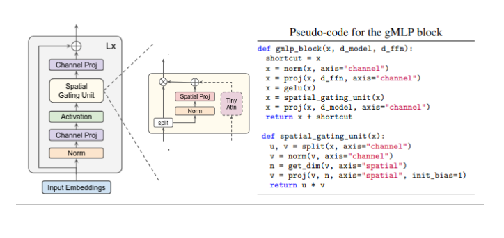

# Spatial Gating ChessBot
Implements spatial gating with attention (a-MLP) from the paper [Pay Attention to MLPs](https://arxiv.org/pdf/2105.08050v2) as the backbone of a ChessBot.

## Architecture
The main block of the SGU ChessNet consists of two components:
1. A gMLP module: implementation is taken from the pseudocode of the paper, and uses the attention module suggested by the authors. However it is less tiny and uses 1D relative position bias for better performance.
2. Global MLP: a normal mlp with LayerNorm, GELU, linear layers, and residual connection between input and output. Acts on flattened features to attend globally


<div align="center"  id="image.png">
  
  <p><em>Pseudo code from paper. Original diagram modified to show tiny-attention module, used in the SGU ChessNet.</em></p>
</div>

In addition, the two prediction networks contain 4 linear layers, LayerNorm+GELU activation, and a skip connection between the first two layers.

```python
# Pseudo-code for main SGU block as used in SGU ChessNet
def sgu_block(x):
  x = x + amlp_block(x)
  x = x + mlp(x.flatten()).unflatten()
```


<!-- ### Training Plots and Scores -->
<!--  -->

## Model Overview
### Stats
<div align="center">

| Model Name   | Layers | Model Shape  | Params      | Weights       |
|--------------|--------|--------------|-------------|---------------|
| SGU ChessNet | 24     | (B, 64, 32)  | 283M        | [Download Coming](path_to_model) |

</div>

### Performance
<div align="center">

| Metric Type | Top-1  | Top-5  | Top-10 | Cross-Entropy | MSE    | MAE    |
|-------------|--------|--------|--------|---------------|--------|--------|
| **Policy**  | 46.21% | 86.28% | 96.09% | 1.6186        | -      | -      |
| **Value**   | -      | -      | -      | -             | 0.3844 | 0.4362 |

</div>

## Usage
*Coming soon*

 Play against the model with the following commandL

```bash
chessbot play "sgu_chessnet" \--model-weights KeithG33/sgu_chessbot