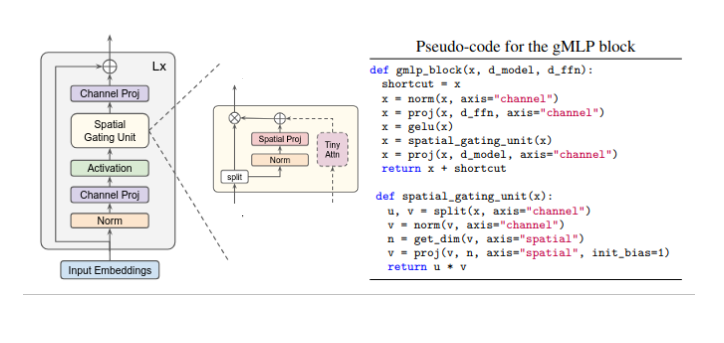

# Spatial Gating ChessNet

## Relevant Papers and Research
Link to papers or research that influenced or are directly related to the model:
- [Pay Attention to MLPs](https://arxiv.org/pdf/2105.08050v2)
- [Deep Residual Learning for Image Recognition](https://arxiv.org/abs/1512.03385)


## Architecture
The main block of the SGU ChessNet consists of two components: A gMLP module and a linear residual module that acts on the flattened features. The gMLP implementation is taken from the pseudocode of the paper, and uses an attention module as suggested by the authors. However to spice things up, the attention module is less tiny and uses 1D relative position bias for better performance.

<div align="center"  id="image.png">
  
  <p><em>Pseudo code from paper. Original diagram modified to show tiny-attention module, used in the SGU ChessNet.</em></p>
</div>

The second part is a straightforward MLP with LayerNorm, GELU, linear layers, and a residual connection between input and output. For global mixing, features are flattened before the MLP.

### Main Features
- **Feature 1**: Spatial Gating Block with 1D RelPos Attn
- **Feature 2**: Res-MLP acting on flattened features


### Training Plots
Include plots here to show the training progress and validation results over time.


## Usage
Provide instructions on how to use the model, including how to load and run predictions, if applicable.

```bash
# Example command to run predictions
python predict.py --model path_to_model --input path_to_input_data
